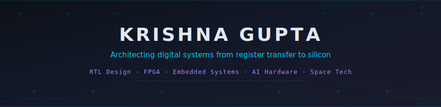
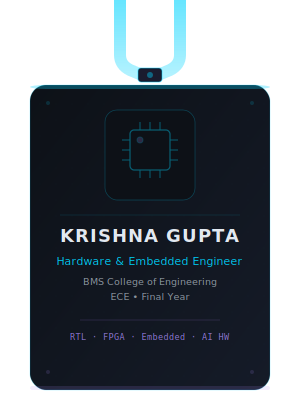

<!-- ✨ Animated Banner ✨ -->
<picture>
  <source media="(prefers-color-scheme: dark)" srcset="banner.svg">
  <source media="(prefers-color-scheme: light)" srcset="banner.svg">
  
</picture>

 

<table align="center" border="0">
<tr>
<td width="38%" align="center" valign="middle">

<!-- 🪪 Swinging Lanyard ID Card -->

</td>
<td width="62%" valign="middle">

### 👨‍💻 About Me

**Bridging the gap between software algorithms and silicon logic.**

I am a final-year Electronics and Communication Engineering (ECE) student specializing in **Digital Design**, **FPGA**, and **Embedded Systems**. Passionate about architecting efficient hardware solutions, writing clean RTL in Verilog/SystemVerilog, and exploring the intersection of IoT, AI hardware, and Space Technology.

 

  
  

</td>
</tr>
</table>

<!-- 🟢 SKILLS & INTERESTS (2-Column Layout) -->
<table align="center" border="0" width="100%">
<tr>
<td width="55%" valign="top">

### ⚡ Hardware & Digital Design

  
  
  
  
  

### 🔬 Languages & Firmware

### 💻 Software & Tools

</td>
<td width="45%" valign="top">

### 🌌 Current Focus & Interests

- 🛰️ **Space Tech:** Applying embedded systems in aerospace computing.
- 🧠 **AI Hardware:** Hardware accelerators for Machine Learning.
- ⚙️ **Rust for Embedded:** Memory-safe systems programming.
- 🌐 **IoT & Edge Computing:** Building connected smart ecosystems.

 
 

> *"Hardware is just petrified software."*

</td>
</tr>
</table>

<!-- 🟢 FEATURED PROJECTS -->
<h3 align="center">🛠️ Featured Engineering Projects</h3>
 

  
  

 

  
  

<!-- 🟢 GITHUB STATS -->
<h3 align="center">📊 GitHub Analytics</h3>
 

  
  

 

  

 

  

 

<!-- 🟢 FOOTER -->

  

