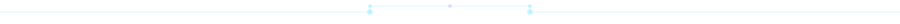
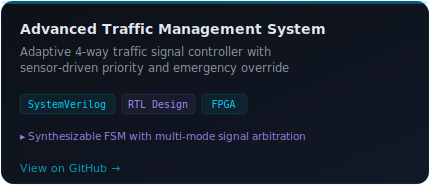
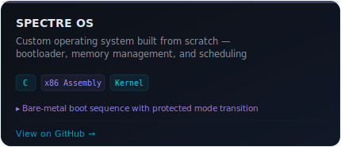
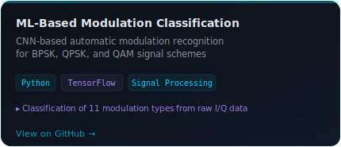
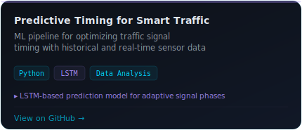
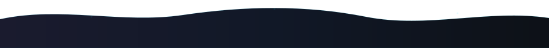

<div align="center">

<!-- ═══════════════════════════════════════════════════════════════ -->
<!--  BANNER — Silicon Blueprint                                    -->
<!-- ═══════════════════════════════════════════════════════════════ -->

<picture>
  <source media="(prefers-color-scheme: dark)" srcset="banner.svg">
  <source media="(prefers-color-scheme: light)" srcset="banner.svg">
  
</picture>

</div>

<br/>

<!-- ═══════════════════════════════════════════════════════════════ -->
<!--  DIVIDER                                                       -->
<!-- ═══════════════════════════════════════════════════════════════ -->

<div align="center">
  
</div>

<br/>

<!-- ═══════════════════════════════════════════════════════════════ -->
<!--  ABOUT ME                                                      -->
<!-- ═══════════════════════════════════════════════════════════════ -->

<div align="center">
  
</div>

<br/>

<table align="center" border="0">
<tr>
<td width="38%" align="center" valign="middle">


</td>
<td width="62%" valign="middle">

**Architecting digital systems from register transfer to silicon.**

Final-year **Electronics & Communication Engineering** student at BMS College of Engineering, Bengaluru. I design synthesizable RTL in Verilog/SystemVerilog, develop FPGA-based digital systems, and build bare-metal embedded firmware. Currently exploring AI hardware accelerators and space-grade computing architectures.

<br/>

<p align="left">
  <a href="mailto:gkrishna7976@gmail.com">
    
  </a>&nbsp;
  <a href="https://www.linkedin.com/in/krishnagupta125/">
    
  </a>
</p>

</td>
</tr>
</table>

<br/>

<!-- ═══════════════════════════════════════════════════════════════ -->
<!--  DIVIDER                                                       -->
<!-- ═══════════════════════════════════════════════════════════════ -->

<div align="center">
  
</div>

<br/>

<!-- ═══════════════════════════════════════════════════════════════ -->
<!--  ENGINEERING DOMAINS                                           -->
<!-- ═══════════════════════════════════════════════════════════════ -->

<div align="center">
  
</div>

<br/>

<table align="center" border="0" width="100%">
<tr>
<td width="50%" valign="top">

**HDL & RTL**

<p>
  
  
  
  
</p>

**Embedded & Firmware**

<a href="https://skillicons.dev">
  
</a>

**Systems & Toolchain**

<a href="https://skillicons.dev">
  
</a>

</td>
<td width="50%" valign="top">

**Engineering Focus**

- **RTL & FPGA** — Synthesizable Verilog/SystemVerilog for complex digital systems
- **Embedded Systems** — ARM Cortex-M, bare-metal firmware, RTOS
- **AI Hardware** — Neural network accelerators and edge inference
- **Space Technology** — Radiation-tolerant computing, satellite subsystems
- **Rust for Embedded** — Memory-safe systems programming on MCUs

<br/>

**EDA & Simulation**

<p>
  
  
  
</p>

**Currently Learning**

<p>
  
  
  
</p>

</td>
</tr>
</table>

<br/>

<!-- ═══════════════════════════════════════════════════════════════ -->
<!--  DIVIDER                                                       -->
<!-- ═══════════════════════════════════════════════════════════════ -->

<div align="center">
  
</div>

<br/>

<!-- ═══════════════════════════════════════════════════════════════ -->
<!--  FEATURED PROJECTS                                             -->
<!-- ═══════════════════════════════════════════════════════════════ -->

<div align="center">
  
</div>

<br/>

<div align="center">
  <a href="https://github.com/krishnag-12/Advance_Traffic_Management_System">
    
  </a>
  <a href="https://github.com/krishnag-12/SPECTRE_OS">
    
  </a>
</div>

<br/>

<div align="center">
  <a href="https://github.com/krishnag-12/ML_Based_Automatic_Modulation_Classification">
    
  </a>
  <a href="https://github.com/krishnag-12/Predictive_Timing_for_Smart_Traffic_Systems">
    
  </a>
</div>

<br/>

<!-- ═══════════════════════════════════════════════════════════════ -->
<!--  DIVIDER                                                       -->
<!-- ═══════════════════════════════════════════════════════════════ -->

<div align="center">
  
</div>

<br/>

<!-- ═══════════════════════════════════════════════════════════════ -->
<!--  GITHUB ANALYTICS                                              -->
<!-- ═══════════════════════════════════════════════════════════════ -->

<div align="center">
  
</div>

<br/>

<div align="center">
  
</div>

<br/>

<div align="center">
  
</div>

<br/>

<!-- ═══════════════════════════════════════════════════════════════ -->
<!--  DIVIDER                                                       -->
<!-- ═══════════════════════════════════════════════════════════════ -->

<div align="center">
  
</div>

<br/>

<!-- ═══════════════════════════════════════════════════════════════ -->
<!--  TRAJECTORY / GOALS                                            -->
<!-- ═══════════════════════════════════════════════════════════════ -->

<div align="center">
  
</div>

<br/>

<div align="center">

```
  ┌─────────────┐     ┌─────────────┐     ┌─────────────────────┐
  │  NEAR-TERM  │────▸│  MID-TERM   │────▸│     LONG-TERM       │
  └──────┬──────┘     └──────┬──────┘     └──────────┬──────────┘
         │                   │                       │
    RISC-V core         ASIC design            AI hardware
    implementation      flow (Synth →          accelerator
                        PnR → DRC)             architecture
    UVM-based                                  
    verification        Open-source FPGA       Space-grade
    methodology         toolchain work         flight software
```

</div>

<br/>

<!-- ═══════════════════════════════════════════════════════════════ -->
<!--  DIVIDER                                                       -->
<!-- ═══════════════════════════════════════════════════════════════ -->

<div align="center">
  
</div>

<br/>

<!-- ═══════════════════════════════════════════════════════════════ -->
<!--  CONNECT                                                       -->
<!-- ═══════════════════════════════════════════════════════════════ -->

<div align="center">
  
</div>

<br/>

<div align="center">
  <a href="mailto:gkrishna7976@gmail.com">
    
  </a>&nbsp;&nbsp;
  <a href="https://www.linkedin.com/in/krishnagupta125/">
    
  </a>&nbsp;&nbsp;
  <a href="https://github.com/krishnag-12">
    
  </a>
</div>

<br/>
<br/>

<!-- ═══════════════════════════════════════════════════════════════ -->
<!--  FOOTER                                                        -->
<!-- ═══════════════════════════════════════════════════════════════ -->

<div align="center">
  
</div>
